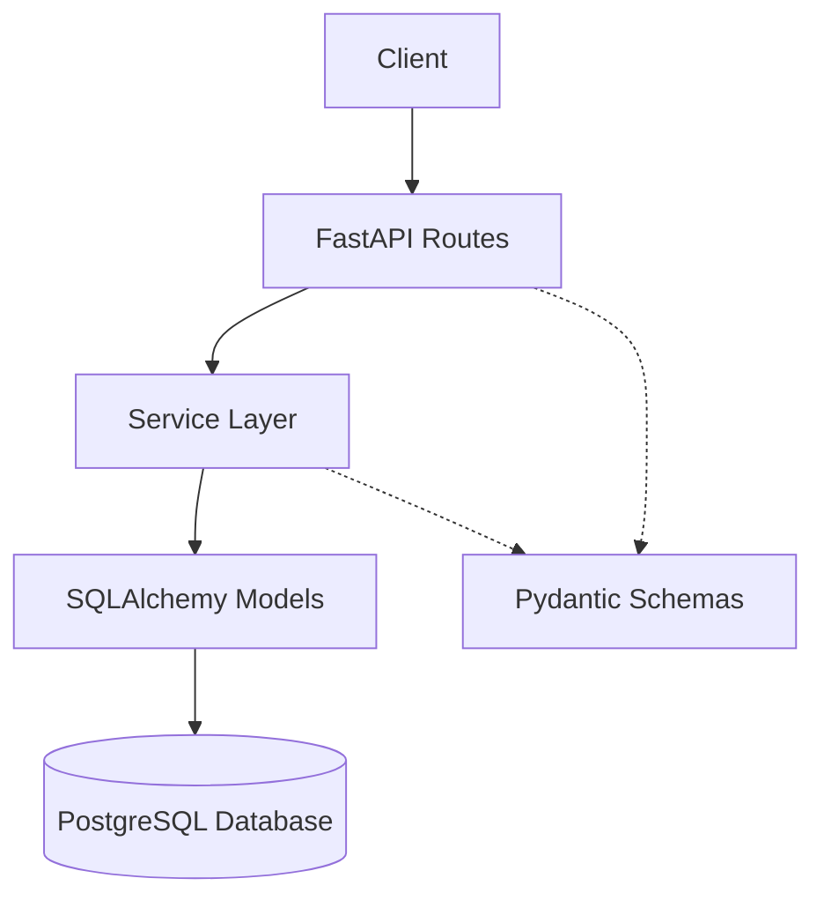
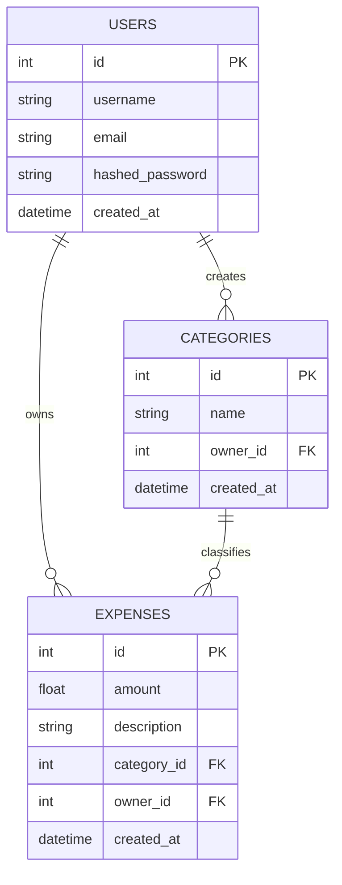

# 🏗️ Architecture Explanation

This document provides a deep dive into the technical design, directory structure, and architectural patterns used in the Expense Tracker API.

## 🏛️ System Design

The project follows a **Layered Architecture** to ensure separation of concerns, maintainability, and testability.



### 🔹 Layers

1.  **API Layer (`app/api`)**: Handles HTTP requests, dependency injection (authentication, DB sessions), and routes the request to the appropriate service.
2.  **Service Layer (`app/services`)**: Contains the core business logic. It orchestrates operations and interacts with the database models.
3.  **Model Layer (`app/models`)**: Defines the SQLAlchemy database models and relationships.
4.  **Schema Layer (`app/schema`)**: Pydantic models for request validation and response serialization.
5.  **Core Layer (`app/core`)**: Global configuration (`config.py`) and security utilities (`security.py`).

---

## 📂 Directory Structure

```text
├── alembic/              # Database migration scripts
├── app/                  # Main application package
│   ├── api/              # API routes and dependencies
│   ├── core/             # Core config and security
│   ├── db/               # Database session and base model
│   ├── models/           # SQLAlchemy database models
│   ├── schema/           # Pydantic schemas (DTOs)
│   ├── services/         # Business logic layer
│   └── utils/            # Shared utility functions
├── tests/                # Unit and integration tests
├── .env                  # Environment variables (ignored by git)
├── Dockerfile            # Container build instructions
└── docker-compose.yml    # Service orchestration
```

---

## 🔐 Authentication Flow

The API uses **JWT (JSON Web Tokens)** for secure authentication.

1.  **Registration**: User provides username, email, and password. The password is hashed using `bcrypt` before storage.
2.  **Login**: User provides credentials. If valid, the server returns an access token.
3.  **Authorization**: For protected routes, the client sends the token in the `Authorization: Bearer <token>` header. The `get_current_user` dependency validates the token and retrieves the user from the database.

---

## 📊 Data Model

The database schema consists of three primary tables:



---

## 🔄 Database Migrations

Migrations are handled by **Alembic**. This ensures that the database schema is versioned and can be evolved safely.

- **Create a migration**: `alembic revision --autogenerate -m "description"`
- **Apply migrations**: `alembic upgrade head`

---

## 🚀 Deployment Strategy

The application is containerized using **Docker**. The `Dockerfile` uses a multi-stage-like approach (slim image) to keep the footprint small. **Docker Compose** is used to orchestrate the API and the PostgreSQL database, ensuring they can communicate over a private network.
